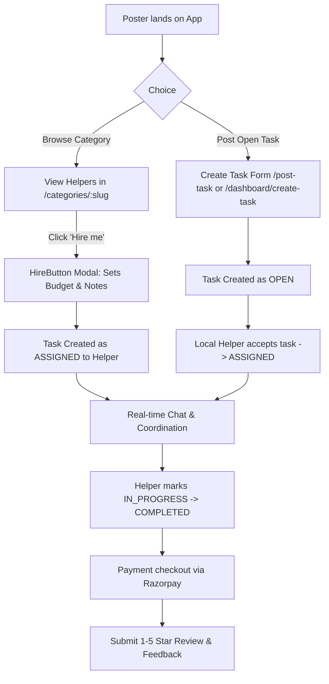
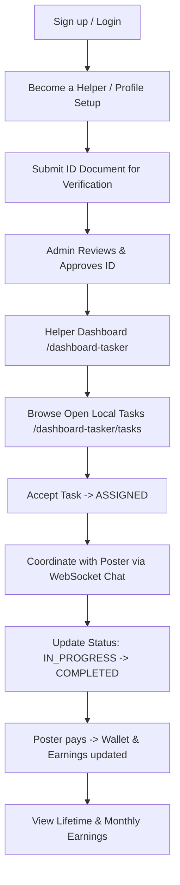

# HireBuddy — Product Context

## Problem Statement & Context
Everyday micro-tasks fall into an awkward gap in the modern service economy:
1. **Too small for agencies**: Professional home-service agencies impose high minimum callout fees, rigid scheduling, and slow booking windows for tasks that take only 15–30 minutes.
2. **Too urgent to delay**: Errands like pharmacy runs, elder transport, or urgent plumbing leaks require assistance within hours, not days.
3. **Too local for remote platforms**: Standard gig portals focus on digital deliverables or national scale, missing the physical density of local neighborhoods.
4. **Trust deficit**: Inviting strangers into homes or delegating errands without identity vetting creates hesitation and friction.

HireBuddy solves this by optimizing for **local density**, **human trust**, and **low-friction coordination**.

---

## User Journeys & Core Workflows

### 1. General & Landing Experience
- Visitors arrive at `/` and can filter tasks/helpers by locality (e.g., Modipuram, Meerut).
- Quick entry points: **Post a Task** (`/post-task`), **Become a Helper** (`/become-a-helper`), or browse standard service categories (Cleaning, Repairs, Furniture Assembly, Grocery Shopping, Elder Care, Delivery, Driver, Home Support).
- Category detail pages (`/categories/[slug]`) display verified local taskers, their hourly rates, availability, ratings, and a 1-click **Hire me** modal.

### 2. Task Poster (Customer) Experience

- **Poster Dashboard** (`/dashboard`):
  - Quick actions (Create Task, My Tasks, Find Helpers, Services).
  - Upcoming task tracker and recent helper shortcuts.
  - Detailed task views with status tracking (`/dashboard/my-tasks/[id]`).

### 3. Tasker / Helper Experience

- **Tasker Dashboard** (`/dashboard-tasker`):
  - Live metric cards: Assigned tasks, Active tasks now, Total earnings in ₹.
  - "Today's Work" primary focus card.
  - Quick navigation to Available Tasks feed, Accepted Tasks, and Notifications.
  - Profile & ID verification management (`/dashboard-tasker/profile`).
  - Earnings overview (`/dashboard-tasker/earnings`).

### 4. Admin Verification Journey
- Accessible at `/dashboard/admin/verify-ids`.
- Secure administrative token entry.
- Visual inspection of helper identity documents, user phone, and city.
- One-click actions to set status to `VERIFIED` or `REJECTED` (with optional rejection notes).

---

## Trust & Safety Framework
Trust is embedded into every stage of the platform:
1. **Identity & Phone Verification**:
   - Phone-based authentication with OTP storage (`Otp` model).
   - Helper ID submission pipeline (`UNVERIFIED` → `PENDING` → `VERIFIED` / `REJECTED`).
   - Verified badge dynamically highlighted on helper cards and search results.
2. **Geographic Scoping**:
   - Tasks and helpers are geocoded with latitude/longitude coordinates.
   - Proximity search filters (Haversine formula in database service; `_geo_distance` filter in Elasticsearch) ensure helpers only service nearby areas.
3. **Escrow-Like Closed-Loop Payments**:
   - Razorpay order creation tied directly to unique `taskId`.
   - Payment signature verification (HMAC SHA-256) ensures payment integrity before task marks completed.
4. **Reputation & Review Integrity**:
   - Reviews are strictly gated: users can only leave reviews on `COMPLETED` tasks.
   - Unique constraint `[taskId, givenById]` prevents duplicate or ballot-box stuffing reviews.

---

## UX & UI Design Principles
- **Modern Dark-First Palette**: Built with Tailwind CSS using `slate-950` backgrounds, `slate-900/80` elevated cards, `slate-800` borders, and `emerald-500` / `blue-600` action accents.
- **Micro-Interactions**: Custom dropdowns (`CustomDropdown.js`), animated modal overlays (`HireButton.js`), and responsive pill badges (`StatusBadge`, `CategoryCard`).
- **Clarity Over Clutter**: Clean information hierarchy showing only what matters: budget, distance, schedule, and live status.
