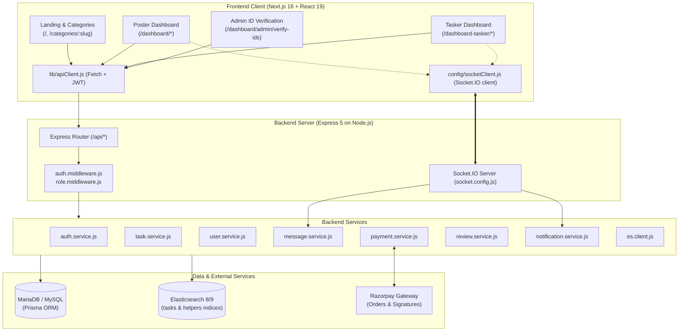
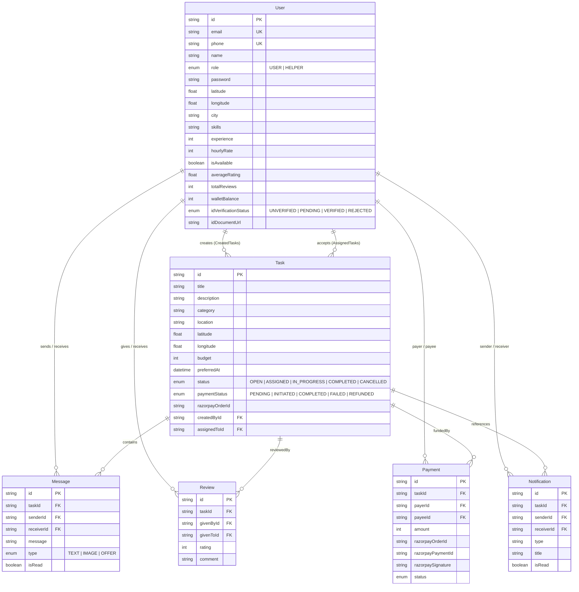

# HireBuddy — System Patterns & Architecture

## High-Level System Architecture



---

## Directory & File Organization

### 1. Backend Structure (`backend/src`)
```
backend/
├── prisma/
│   ├── schema.prisma         # Single source of truth for MariaDB schema
│   └── migrations/           # Versioned SQL migrations
├── scripts/
│   ├── create-indices.js     # ElasticSearch index creation script
│   ├── reindex-all.js        # Full DB-to-ES synchronization script
│   └── seed-helpers.js       # Database seeder for local testing
└── src/
    ├── app.js                # Express app setup, CORS, route mounting
    ├── server.js             # HTTP server creation & Socket.IO initialization
    ├── config/
    │   └── socket.config.js  # WebSocket server, rooms, JWT verification, events
    ├── controllers/          # Request parsing & HTTP response formatting
    │   ├── auth.controller.js
    │   ├── user.controller.js
    │   ├── task.controller.js
    │   ├── hire.controller.js
    │   ├── payment.controller.js
    │   ├── message.controller.js
    │   ├── review.controller.js
    │   └── notification.controller.js
    ├── middlewares/
    │   ├── auth.middleware.js # Bearer token verification and req.user injection
    │   └── role.middleware.js # Role enforcement (USER vs HELPER)
    ├── routes/               # API endpoint definitions
    ├── services/             # Core business logic, queries, external APIs
    └── utils/
        ├── jwt.js            # Token generation & decoding
        └── prisma.js         # PrismaClient singleton with MariaDB adapter
```

### 2. Frontend Structure (`webapp/app`)
```
webapp/app/
├── layout.js                 # Global HTML structure, fonts, CSS import
├── providers.js              # SessionProvider wrapper for NextAuth
├── globals.css               # Global styles & Tailwind v4 directives
├── page.js                   # Landing page (Category grid, location selector)
├── post-task/                # Quick task posting form
├── become-a-helper/          # Helper registration workflow
├── categories/[slug]/        # Category details & listings (CategoryListingsClient)
├── dashboard/                # Customer/Poster view
│   ├── page.js               # Overview dashboard
│   ├── create-task/          # Full task creator form
│   ├── my-tasks/             # Task listing and detail pages [id]
│   ├── helpers/              # Browse and view helper profiles [id]
│   ├── search/               # Search UI
│   ├── notifications/        # User notification inbox
│   ├── settings/             # Profile & user settings
│   └── admin/verify-ids/     # Administrative ID approval dashboard
├── dashboard-tasker/         # Helper/Tasker view
│   ├── page.js               # Tasker overview, earnings, today's work
│   ├── tasks/                # Open task discovery feed
│   ├── my-tasks/             # Assigned/accepted tasks & execution [id]
│   ├── earnings/             # Financials & wallet details
│   ├── profile/              # Helper skills, rate & ID submission (edit)
│   └── notifications/        # Tasker alerts
└── components/
    ├── config/socketClient.js # Socket.IO client singleton & event emitters
    ├── lib/                  # apiClient.js, endpoints.js, getSessionToken.js
    ├── services/             # Frontend service layer mapping to backend APIs
    ├── ui/                   # HelperCard, Avatar, Badge, Button
    ├── category/             # CategoryCard, categories.js
    ├── hire/                 # HireButton modal
    └── reuseable/            # CustomDropdown.js
```

---

## Data Schema & Relationship Patterns (`schema.prisma`)



---

## Core System Patterns & Design Decisions

### 1. Hybrid Search with Failover
- **Elasticsearch Primary**:
  - `tasks` index: Analyzed fields (`title`, `description`), keyword fields (`category`, `city`), and `geo_point` (`location`).
  - `helpers` index: Analyzed fields (`name`, `skills`), keyword subfields, and `geo_point` coordinates.
  - Sorts and filters by plane geo-distance (`_geo_distance`) within specified radius (e.g., 5km, 50km).
- **Relational Fallback**:
  - If Elasticsearch cluster is unreachable or errors out, backend catches the exception and falls back to relational MariaDB query via `dbSearchTasks()` using Prisma.

### 2. Real-Time Room Isolation via Socket.IO
- Socket connections authenticate using JWT token via socket handshake middleware.
- Communication is compartmentalized into rooms per task: `task_${taskId}`.
- When an event occurs:
  - `join_task`: Clients join room, receiving status and read confirmations.
  - `send_message`: Message persists to MariaDB `Message` table first, then broadcasts to the room.
  - If recipient is offline (not in `userSockets` map), an asynchronous offline notification is recorded in the `Notification` table.

### 3. Direct Hire Workflow vs. Open Bidding
- HireBuddy bypasses complex bidding mechanisms.
- Posters can post an unassigned task (`OPEN`) that appears in the helper feed.
- Alternatively, posters can browse category listings, click `Hire me` on a helper card, and trigger `POST /api/hire`. This immediately provisions a Task pre-assigned to `helperId` with status `ASSIGNED`, bypassing the discovery queue.

### 4. Monetary Precision Pattern
- All monetary amounts in database and APIs (`budget`, `hourlyRate`, `walletBalance`, `amount`) are represented in **paise** (integers) rather than floating-point values to eliminate rounding and precision errors. Conversion to Rupee (₹) is handled on display or formatted in API helpers.

### 5. Authentication Token Flow
- Dual login paths supported:
  1. Phone + Password (via `/api/auth/login`) or Phone + OTP.
  2. Google OAuth via NextAuth frontend provider, which then synchronizes with backend via `POST /api/auth/google`.
- JWT payload encodes `{ id: user.id, role: user.role }` with a 7-day expiration.
- Frontend `apiClient.js` automatically pulls token from either `localStorage.getItem("token")` or NextAuth session.
